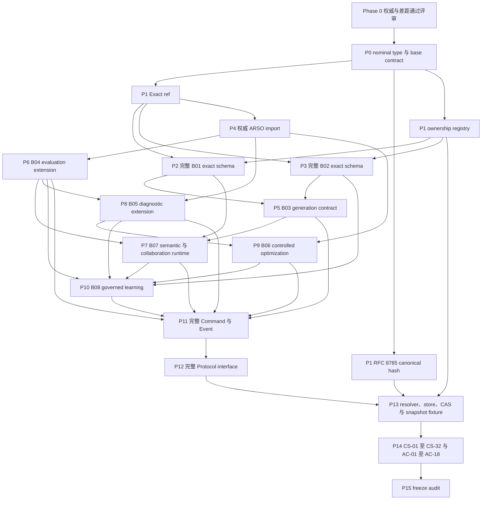

# Phase 0 实施清单

审计日期：2026-09-03  
规范目标：Design Intelligence V5.0 Exact V1 / ARSO V2.2.1 Reference Application  
当前结论：现有内容属于可执行的部分基线，不是完整的 Exact V1 实现

## 当前仓库概况

| 检查范围 | 现场状态 | 审计判定 |
|---|---|---|
| 规范包 | `specs/` 下存在 7 份规范 | 文件齐全，路径已经统一。 |
| Python package | `di_contracts_v1/di_contracts` | 已存在的 F6.1 candidate baseline。 |
| 运行环境声明 | Python `>=3.12`、Pydantic `>=2.12,<3` | 符合优先级 1 规范的基线要求。 |
| 本地自动测试 | 共收集 46 项，隔离 `uv` 环境中 46 项全部通过 | 仅为部分测试；没有任何一项被标识为完整的 CS/AC gate。 |
| Registry | 44 个 entry | 不完整；一个 B01 sentinel 无法导入，B02、ARSO、Infrastructure 均缺失。 |
| JSON Schema | 已生成 104 份 schema | 已具备生成能力，但数量不能证明 mandatory contract 完整。 |
| Command | 4 个具体 command schema | inventory 不完整。 |
| Event | 1 个 event schema | inventory 不完整。 |
| Protocol | 4 个 protocol class | 能力和签名不完整，缺少 static type gate。 |
| Git 治理 | 仓库根目录不是 Git repository | 当前无法证明 branch、commit、PR 和 freeze 流程。 |

## 状态术语

- `PRESENT-CANDIDATE`：已有具体 model，但 Exact V1 尚未冻结。
- `SENTINEL`：registry 中有 metadata，但对应 implementation type 无法导入。
- `MISSING`：当前没有 canonical model 或 registry entry。
- `EXTERNAL-MISSING`：规范要求外部权威 type，但当前没有 import/adaptation boundary。

## DI canonical object 映射

当规范存在直接关系时，下表同时列出 command、event、protocol 和 conformance gate。
“尚未冻结”表示完整 inventory 本身仍是 release blocker，Phase 0 不得自行补造。

| 规范对象 | Primitive Owner | 目标 Python 模块 / Model | 当前状态 | 关联 Command、Event 或 Protocol | 主要 Gate |
|---|---|---|---|---|---|
| StyleBrief | DI-B01 | `contracts/b01/style_brief.py::StyleBrief` | MISSING | 语义创建 command 尚未冻结 | AC-01、CS-03 |
| DesignContextBinding | DI-B01 | `contracts/b01/context.py::DesignContextBinding` | MISSING | 语义转换 command 尚未冻结 | AC-01 |
| DesignDecision | DI-B01 | `contracts/b01/decision.py::DesignDecision` | MISSING | 语义转换 command 尚未冻结 | AC-01 |
| DesignRoute | DI-B01 | `contracts/b01/route.py::DesignRoute` | MISSING | 路线选择 command 尚未冻结 | AC-01 |
| DesignSpec | DI-B01 | `contracts/b01/spec.py::DesignSpec` | SENTINEL：registry 指向缺失的 `external.B01.DesignSpec` | 已有 `RequestDesignEditCommand`，但 owner-mediated commit 接口不完整 | AC-01、CS-06、CS-08 |
| ReferenceIntentBinding | DI-B01 | `contracts/b01/references.py::ReferenceIntentBinding` | MISSING | 尚未冻结 | AC-01、CS-09 |
| DesignTaskBinding | DI-B01 | `contracts/b01/task_binding.py::DesignTaskBinding` | MISSING | ARSO ReferenceTask binding protocol 缺失 | AC-01、CS-03、CS-04 |
| FashionOntology | DI-B02 | `contracts/b02/ontology.py::FashionOntology` | MISSING | 已有 `RequestFashionSemanticCommitCommand`，但 owner implementation 缺失 | AC-02、CS-28 |
| DesignGrammar | DI-B02 | `contracts/b02/grammar.py::DesignGrammar` | MISSING | 同上 | AC-02、CS-28 |
| SemanticParameterSpace | DI-B02 | `contracts/b02/parameter_space.py::SemanticParameterSpace` | MISSING | 同上 | AC-02、CS-28 |
| ApplicabilityRule | DI-B02 | `contracts/b02/applicability.py::ApplicabilityRule` | MISSING | 同上 | AC-02 |
| GenerationCompiler | DI-B03 | `contracts/b03/models.py::GenerationCompiler` | PRESENT-CANDIDATE | Executor / Model Gateway protocol 缺失 | CS-07、CS-29 |
| CompilerMappingTrace | DI-B03 | `contracts/b03/models.py::CompilerMappingTrace` | PRESENT-CANDIDATE | Compile protocol 缺失 | CS-08、CS-09 |
| GenerationPackage | DI-B03 | `contracts/b03/models.py::GenerationPackage` | PRESENT-CANDIDATE | Executor protocol 缺失 | CS-08、CS-19 |
| DesignInstance | DI-B03 | `contracts/b03/models.py::DesignInstance` | PRESENT-CANDIDATE | Run integration protocol 缺失 | CS-18、CS-20 |
| ObjectiveDefinition | DI-B04 | `contracts/b04/models.py::ObjectiveDefinition` | PRESENT-CANDIDATE | ARSO evaluation integration 缺失 | AC-03、CS-19 |
| EvaluationContract | DI-B04 | `contracts/b04/models.py::EvaluationContract` | PRESENT-CANDIDATE | ARSO evaluation integration 缺失 | AC-03、CS-19 |
| EvaluatorCalibrationProfile | DI-B04 | `contracts/b04/models.py::EvaluatorCalibrationProfile` | PRESENT-CANDIDATE | ARSO evaluation integration 缺失 | AC-03、CS-29 |
| StructuredFinding | DI-B04 | `contracts/b04/models.py::StructuredFinding` | PRESENT-CANDIDATE | Event inventory 尚未冻结 | CS-19 |
| DiagnosticPolicy | DI-B05 | `contracts/b05/models.py::DiagnosticPolicy` | PRESENT-CANDIDATE | ARSO diagnosis integration 缺失 | AC-03、CS-22、CS-23 |
| EvidenceConstructionPolicy | DI-B05 | `contracts/b05/models.py::EvidenceConstructionPolicy` | PRESENT-CANDIDATE | ARSO evidence integration 缺失 | AC-03、CS-23、CS-24 |
| DiagnosticCalibrationProfile | DI-B05 | `contracts/b05/models.py::DiagnosticCalibrationProfile` | PRESENT-CANDIDATE | ARSO diagnosis integration 缺失 | AC-03 |
| FashionFailureExtension | DI-B05 | `contracts/b05/models.py::FashionFailureExtension` | PRESENT-CANDIDATE | ARSO extension boundary 缺失 | AC-03 |
| ProbeRecommendation | DI-B05 | `contracts/b05/models.py::ProbeRecommendation` | PRESENT-CANDIDATE | Action / Probe integration 缺失 | CS-21、CS-22 |
| SystemChangeCandidate | DI-B06 | `contracts/b06/models.py::SystemChangeCandidate` | PRESENT-CANDIDATE | Intervention command/event inventory 缺失 | CS-06、CS-29、CS-31 |
| InterventionRisk | DI-B06 | `contracts/b06/models.py::InterventionRisk` | PRESENT-CANDIDATE | Permission protocol 缺失 | CS-06 |
| InterventionTransaction | DI-B06 | `contracts/b06/models.py::InterventionTransaction` | PRESENT-CANDIDATE，仅为 operational state | Transaction orchestration 未实现 | CS-12、CS-31 |
| OptimizationLineageRoot | DI-B06 | `contracts/b06/models.py::OptimizationLineageRoot` | PRESENT-CANDIDATE | 尚未冻结 | CS-10、CS-32 |
| DesignStateRevision | DI-B07 | `contracts/b07/state.py::DesignStateRevision` | PRESENT-CANDIDATE | Branch mutation 接口不完整 | CS-13、CS-14、AC-07 |
| DesignEdit | DI-B07 | `contracts/b07/edit.py::DesignEdit` | MISSING | 已有 `RequestDesignEditCommand` | CS-08、CS-14 |
| DesignEditRequest | DI-B07 | `contracts/b07/edit.py::DesignEditRequest` | PRESENT-CANDIDATE | 已有 `RequestDesignEditCommand` | CS-08 |
| DesignBranchRoot | DI-B07 | `contracts/b07/branch.py::DesignBranchRoot` | PRESENT-CANDIDATE | 已有 `ForkDesignBranchCommand` | CS-13、CS-14 |
| BranchHeadPointer | DI-B07 | `contracts/b07/branch.py::BranchHeadPointer` | PRESENT-CANDIDATE | `DesignBranchRuntime` 仅提供部分 CAS protocol | CS-12、CS-13、AC-09 |
| ForkRecord | DI-B07 | `contracts/b07/branch.py::ForkRecord` | MISSING | 已有 `ForkDesignBranchCommand`，event 缺失 | CS-14、CS-32 |
| MergeAnalysis | DI-B07 | `contracts/b07/merge.py::MergeAnalysis` | MISSING | Merge command/event 尚未冻结 | CS-14 |
| SemanticMergeConflict | DI-B07 | `contracts/b07/merge.py::SemanticMergeConflict` | MISSING | Merge command/event 尚未冻结 | CS-14 |
| MergeResolution | DI-B07 | `contracts/b07/merge.py::MergeResolution` | MISSING | Merge command/event 尚未冻结 | CS-14 |
| MergeRecord | DI-B07 | `contracts/b07/merge.py::MergeRecord` | MISSING | Merge command/event 尚未冻结 | CS-14、CS-32 |
| ReviewSessionRoot | DI-B07 | `contracts/b07/review.py::ReviewSessionRoot` | PRESENT-CANDIDATE | 已有 `ReviewSessionClosedEvent` | CS-15、CS-16 |
| ReviewRoundOpened | DI-B07 | `contracts/b07/review.py::ReviewRoundOpened` | PRESENT-CANDIDATE | Open-round command/event 不完整 | CS-15、CS-16 |
| ReviewRoundOutcome | DI-B07 | `contracts/b07/review.py::ReviewRoundOutcome` | PRESENT-CANDIDATE | Outcome command/event 不完整 | CS-15、CS-16 |
| DesignReviewSnapshot | DI-B07 | `contracts/b07/snapshot.py::DesignReviewSnapshot` | PRESENT-CANDIDATE | Snapshot materialization protocol 缺失 | CS-17、CS-18、CS-19、CS-20、AC-12 |
| ReviewPresentationManifest | DI-B07 | `contracts/b07/snapshot.py::ReviewPresentationManifest` | PRESENT-CANDIDATE | Snapshot materialization protocol 缺失 | CS-17、CS-18 |
| DesignComment | DI-B07 | `contracts/b07/review.py::DesignComment` | MISSING | Comment command/event 尚未冻结 | AC-14 |
| DesignAnnotation | DI-B07 | `contracts/b07/review.py::DesignAnnotation` | MISSING | Annotation command/event 尚未冻结 | AC-14 |
| HumanDecision | DI-B07 | `contracts/b07/review.py::HumanDecision` | PRESENT-CANDIDATE | Decision command/event 不完整 | CS-18 |
| ApprovalRecord | DI-B07 | `contracts/b07/review.py::ApprovalRecord` | PRESENT-CANDIDATE | 已有 `ApproveDesignCommand` | CS-18 |
| DesignLineageRoot | DI-B07 | `contracts/b07/lineage.py::DesignLineageRoot` | PRESENT-CANDIDATE | 尚未冻结 | CS-10、CS-32 |
| MemoryItem | DI-B08 | `contracts/b08/memory.py::MemoryItem` | PRESENT-CANDIDATE | Curation command/event 缺失 | AC-17、CS-27 |
| MemoryCurationDecision | DI-B08 | `contracts/b08/memory.py::MemoryCurationDecision` | PRESENT-CANDIDATE | Curation command/event 缺失 | CS-27、CS-32 |
| PreferenceSignal | DI-B08 | `contracts/b08/preference.py::PreferenceSignal` | PRESENT-CANDIDATE | Signal event inventory 缺失 | AC-14 |
| BrandDNAProfile | DI-B08 | `contracts/b08/knowledge.py::BrandDNAProfile` | PRESENT-CANDIDATE；registry eligibility 偏离规范 | 不得直接激活 | CS-25、CS-30 |
| EnterpriseKnowledgeItem | DI-B08 | `contracts/b08/knowledge.py::EnterpriseKnowledgeItem` | PRESENT-CANDIDATE | 不得直接激活 | CS-25、CS-26、CS-30 |
| LearningProposal | DI-B08 | `contracts/b08/learning.py::LearningProposal` | PRESENT-CANDIDATE | Semantic/system owner routing 不完整 | CS-28、CS-29 |
| KnowledgeClaim | DI-B08 | `contracts/b08/learning.py::KnowledgeClaim` | PRESENT-CANDIDATE | Promotion command/event 不完整 | CS-24、CS-25 |
| PromotionEvidencePack | DI-B08 | `contracts/b08/learning.py::PromotionEvidencePack` | PRESENT-CANDIDATE | ARSO evidence resolver 缺失 | CS-24、AC-03 |
| KnowledgePromotionDecision | DI-B08 | `contracts/b08/learning.py::KnowledgePromotionDecision` | PRESENT-CANDIDATE | `RequestFashionSemanticCommitCommand` 不完整 | CS-25、CS-28 |
| KnowledgeValidity | DI-B08 | `contracts/b08/knowledge.py::KnowledgeValidity` | PRESENT-CANDIDATE | Validity event inventory 缺失 | AC-18 |
| RetentionPolicy | DI-B08 | `contracts/b08/policy.py::RetentionPolicy` | PRESENT-CANDIDATE；registry eligibility 偏离规范 | Policy protocol 缺失 | CS-25、CS-26 |
| KnowledgeAccessPolicy | DI-B08 | `contracts/b08/policy.py::KnowledgeAccessPolicy` | PRESENT-CANDIDATE；registry eligibility 偏离规范 | Policy protocol 缺失 | CS-25、CS-26 |
| KnowledgeSnapshot | DI-B08 | `contracts/b08/snapshot.py::KnowledgeSnapshot` | PRESENT-CANDIDATE | `KnowledgeSnapshotService` 不完整 | CS-25、CS-26、CS-30、AC-11、AC-18 |
| KnowledgeLineageRoot | DI-B08 | `contracts/b08/lineage.py::KnowledgeLineageRoot` | PRESENT-CANDIDATE | 尚未冻结 | CS-10、CS-32 |

## 嵌套的非 canonical value

| Value | Owner | 目标 Model | 当前状态 | Gate |
|---|---|---|---|---|
| CompiledReferenceBinding | DI-B03 | `contracts/b03/references.py` | PRESENT-CANDIDATE，未进入 registry，符合规范 | CS-09 |
| CompilerMappingEntry | DI-B03 | `contracts/b03/mapping.py` | PRESENT-CANDIDATE | CS-08 |
| GenerationConstraintBundle | DI-B03 | `contracts/b03/constraints.py` | PRESENT-CANDIDATE | CS-08 |
| ProposedSystemChange | DI-B06 | `contracts/b06/change.py` | PRESENT-CANDIDATE，保持为嵌套 value | CS-06、CS-29 |

## ARSO canonical integration 映射

下表所有条目当前均为 `EXTERNAL-MISSING`。现有 DI model 只保存通用
`ObjectRef` / `ExactObjectRef`，没有导入或解析权威 ARSO type。

| 规范对象 | Primitive Owner | 目标集成模块 | DI 使用方 | Gate |
|---|---|---|---|---|
| ReferenceTaskSpec | ARSO Core | `contracts/arso/task.py` | B01 DesignTaskBinding、Run closure | AC-03、CS-03、CS-04 |
| SystemSnapshot | ARSO Core | `contracts/arso/snapshot.py` | Generation、Evaluation、Intervention | AC-03、AC-10、CS-05、CS-19、CS-30 |
| RunRecord | ARSO Core | `contracts/arso/runtime.py` | B03 DesignInstance | AC-03、CS-04、CS-19 |
| RuntimeEvent | ARSO Core | `contracts/arso/runtime.py` | Runtime/Event integration | AC-03、AC-05 |
| ObservabilityProfile | ARSO Core | `contracts/arso/diagnosis.py` | B05 | AC-03 |
| ObjectiveSpec | ARSO Core | `contracts/arso/evaluation.py` | B04 EvaluationContract | AC-03 |
| MeasurementSpec | ARSO Core | `contracts/arso/evaluation.py` | B04 EvaluationContract | AC-03 |
| EvaluatorBinding | ARSO Core | `contracts/arso/evaluation.py` | B04/B03 | AC-03、CS-19 |
| EvaluationRecord | ARSO Core | `contracts/arso/evaluation.py` | B04/B07/B08 | AC-03、CS-19、CS-20 |
| EvidenceItem | ARSO Core | `contracts/arso/evidence.py` | B05/B08 | AC-03、CS-23、CS-24 |
| EvidenceBundle | ARSO Core | `contracts/arso/evidence.py` | B05/B08 | AC-03、CS-23、CS-24 |
| DiagnosticBelief | ARSO Core | `contracts/arso/diagnosis.py` | B05/B06/B07 | AC-03、CS-21、CS-22、CS-23 |
| HypothesisRecord | ARSO Core | `contracts/arso/diagnosis.py` | B05/B06 | AC-03、CS-22 |
| IdentifiabilityAssessment | ARSO Core | `contracts/arso/diagnosis.py` | B05 | AC-03、CS-21、CS-22 |
| ProbePlan | ARSO Core | `contracts/arso/probe.py` | B05 action path | AC-03、CS-21、CS-22、CS-23 |
| ProbeResult | ARSO Core | `contracts/arso/probe.py` | B05 evidence path | AC-03、CS-23 |
| ActionDecision | ARSO Core | `contracts/arso/action.py` | B05/B06 | AC-03、CS-22 |
| InterventionPlan | ARSO Core | `contracts/arso/intervention.py` | B06 | AC-03、CS-31 |
| InterventionResult | ARSO Core | `contracts/arso/intervention.py` | B06 | AC-03、CS-31 |
| ValidationPlan | ARSO Core | `contracts/arso/validation.py` | B06 | AC-03、CS-31 |
| ValidationResult | ARSO Core | `contracts/arso/validation.py` | B06/B08 | AC-03、CS-31 |
| ExperimentAssignment | ARSO Core | `contracts/arso/experiment.py` | Run closure | AC-03 |
| BudgetReservation | ARSO Core | `contracts/arso/budget.py` | Probe/Intervention | AC-03、CS-22 |

## Infrastructure 映射

| 规范对象 | Primitive Owner | 目标模块 | 当前状态 | 关联 Protocol / Gate |
|---|---|---|---|---|
| ReferenceAsset | Infrastructure | `contracts/infrastructure/references.py` | MISSING | AssetStore；CS-09、AC-14 |
| AssetRef | Infrastructure | `contracts/infrastructure/references.py` | MISSING | AssetStore；AC-14 |
| Artifact | Infrastructure | `contracts/infrastructure/artifacts.py` | MISSING | ArtifactRegistry；CS-06、CS-07 |
| ArtifactRef | Infrastructure | `contracts/infrastructure/artifacts.py` | MISSING | ArtifactRegistry；CS-06、CS-07 |
| ExecutorCapabilityProfile | Infrastructure | `contracts/infrastructure/executor.py` | MISSING | Executor / Model Gateway；AC-06 |
| ExecutorBinding | Infrastructure | `contracts/infrastructure/executor.py` | MISSING | Executor / Model Gateway；AC-06、CS-19、CS-20 |
| ObjectStore | Infrastructure | `protocols/object_store.py` | `CanonicalObjectStore` 中存在部分 protocol | AC-06、AC-08 |
| AssetStore | Infrastructure | `protocols/asset_store.py` | MISSING | AC-06 |
| ArtifactRegistry | Infrastructure | `protocols/artifact_registry.py` | MISSING | AC-06、CS-07 |

## 当前 Command、Event 与 Protocol 清单

| 类型 | 当前具体接口 | 审计结论 |
|---|---|---|
| Command | `ForkDesignBranchCommand`、`RequestDesignEditCommand`、`ApproveDesignCommand`、`RequestFashionSemanticCommitCommand` | 只能作为参考。完整 inventory 冻结之前，AC-04 仍被阻断。 |
| Event | `ReviewSessionClosedEvent` | 标准化方向正确，但 AC-05 仍被阻断。 |
| Protocol | `CanonicalObjectStore`、`ObjectRegistry`、`DesignBranchRuntime`、`KnowledgeSnapshotService` | 不完整。缺少 `CanonicalObjectStore.resolve_logical_for_authoring`、AssetStore、ArtifactRegistry、Executor / Model Gateway、ARSO integration boundary、exact signature 和 static type fixture。 |

## 建议的仓库与 package 结构

以下内容只是审计建议。Phase 0 没有创建或移动这些路径。

```text
AGENTS.md
SPEC_AUTHORITY.md
IMPLEMENTATION_MANIFEST.md
CONTRACT_GAP_REPORT.md
SPEC_CONFLICTS.md

specs/                              # 当前唯一规范入口，使用 checksum 防止意外漂移
  00-CODE-FREEZE/
  01-AUTHORITY/
  02-UPSTREAM/
  03-RESEARCH/

src/design_intelligence/
  contracts/
    core/
      identity.py
      refs.py
      versions.py
      metadata.py
      hashing.py
      enums.py
    arso/                           # 只能存放权威 import / adapter
    infrastructure/
    b01/
    b02/
    b03/
    b04/
    b05/
    b06/
    b07/
    b08/
  registry/
    manifest.py
    ownership.py
    validation.py
  commands/
  events/
  protocols/
  resolution/
  errors/

tests/
  unit/
  schemas/
  registry/
  references/
  immutability/
  commands/
  events/
  protocols/
  conformance/
    cs_01_08/
    cs_09_16/
    cs_17_24/
    cs_25_32/
    ac/

generated/
  json_schema/
  registry_manifest.json

legacy_baseline/
  di_contracts_v1/                 # 可在评审后考虑迁移；Phase 0 不执行
```

## CS-01 至 CS-32

| ID | 验收要求 |
|---|---|
| CS-01 | 每个 canonical object 只有一个 Primitive Owner。 |
| CS-02 | Capability Owner 与 Primitive Owner 可以明确区分。 |
| CS-03 | StyleBrief 不能直接作为 ReferenceTaskSpec。 |
| CS-04 | 每个 ARSO Run 都能解析 exact ReferenceTaskSpec。 |
| CS-05 | SystemSnapshot 不包含单次任务的 Brief、Decision、Route 或 Spec。 |
| CS-06 | 普通 System Intervention 不能把 DesignSpec 当作 artifact 修改。 |
| CS-07 | System Artifact 与 Task Semantic Object 在类型上可区分。 |
| CS-08 | B03 EDIT 不创建新的 Design semantics。 |
| CS-09 | ReferenceAsset、ReferenceIntentBinding 与 CompiledReferenceBinding 严格区分。 |
| CS-10 | Design、Optimization 与 Knowledge lineage 都是 immutable root。 |
| CS-11 | Execution 不创建第五条长期 lineage。 |
| CS-12 | Job 和 pointer 不能成为 historical SSOT。 |
| CS-13 | Branch head 更新必须使用 CAS。 |
| CS-14 | 历史 DesignState 永不更新。 |
| CS-15 | 关闭 review 不得修改 Session/round root。 |
| CS-16 | ReviewStage 只能是 collaboration fact 的 projection。 |
| CS-17 | ReviewSnapshot 不得包含未物化的 dynamic View。 |
| CS-18 | HumanDecision 必须能够重建 reviewer 当时实际看到的内容。 |
| CS-19 | Generation snapshot 与 Evaluation snapshot 必须分别可追溯。 |
| CS-20 | Review 可以比较具有不同 executor provenance 的 instance。 |
| CS-21 | ProbeRecommendation 不具有执行权限。 |
| CS-22 | 只有在 REQUEST_EVIDENCE 之后才能创建可执行 ProbePlan。 |
| CS-23 | ProbeResult 必须先形成 Evidence 并触发 Rediagnosis，之后才能 repair。 |
| CS-24 | PromotionEvidencePack 引用 ARSO Evidence，不复制第二套 Evidence。 |
| CS-25 | B08 不拥有 Knowledge activation authority。 |
| CS-26 | Knowledge content 与 retrieval mechanism 分离。 |
| CS-27 | MemoryMaturity 与 KnowledgeMaturity 类型安全且互不混用。 |
| CS-28 | 最终 semantic writeback 由 B02 commit。 |
| CS-29 | Compiler/Evaluator learning 必须经过 E05/E06。 |
| CS-30 | Stable Knowledge 不会自动加入 active SystemSnapshot。 |
| CS-31 | Validated Intervention 不会自动变成 Stable Knowledge。 |
| CS-32 | 所有长期 feedback loop 都必须创建新 version 或 snapshot。 |

## AC-01 至 AC-18

| ID | 验收要求 |
|---|---|
| AC-01 | B01 exact schema 完整。 |
| AC-02 | B02 exact schema 完整。 |
| AC-03 | 使用权威 ARSO type import。 |
| AC-04 | Command inventory 完整且 exact。 |
| AC-05 | Event inventory 完整且 exact。 |
| AC-06 | Protocol signature 完整，并通过 static type check。 |
| AC-07 | 具备 semantic closure resolver fixture。 |
| AC-08 | 具备 CanonicalObjectStore revision-parent fixture。 |
| AC-09 | 具备 BranchHead CAS fixture。 |
| AC-10 | 具备 SystemSnapshot negative firewall。 |
| AC-11 | 具备 KnowledgeSnapshot negative firewall。 |
| AC-12 | 具备 DesignReviewSnapshot provenance firewall。 |
| AC-13 | 具备 RFC 8785 cross-language hash fixture。 |
| AC-14 | Registry 包含所有 mandatory canonical object。 |
| AC-15 | 完成 forbidden shadow-type scan。 |
| AC-16 | 完成 ambiguous bare-name scan。 |
| AC-17 | MemoryItem 不包含重复 lifecycle field。 |
| AC-18 | KnowledgeSnapshot 不包含 mandatory 的重复 validity closure。 |

## 实施依赖图



每个节点都必须执行一次 `Implement -> Test -> Audit -> Freeze` 小循环。
局部 unit test 通过，不代表已经获得进入下游节点的授权。
