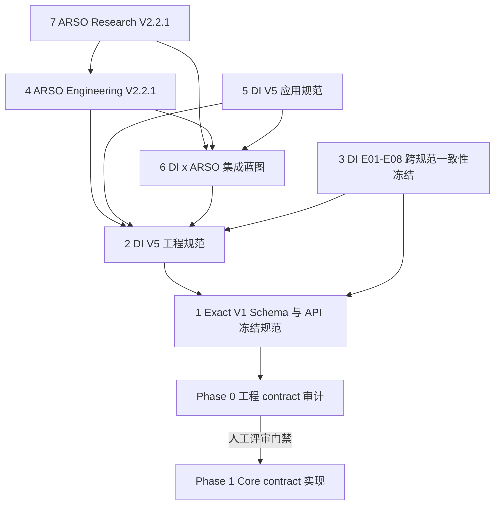

# Phase 0 规范权威说明

审计日期：2026-09-03  
仓库：ARSOFashion  
阶段：规范摄取与仓库一致性审计  
结论：权威链已经建立；Phase 0 已通过评审，Phase 1 已获授权

## 规范输入路径说明

规范已经统一迁移到 `specs/`。该目录现在是唯一规范入口，包含预期的 7 份规范；
原目录路径不再使用。Phase 1 使用 SHA-256 manifest 验证迁移后的
规范源内容没有发生意外漂移。

## 规范权威顺序

| 优先级 | 仓库内规范 | 文档身份与状态 | 规范职责 |
|---:|---|---|---|
| 1 | `specs/00-CODE-FREEZE/DI_V5_Exact_V1_Schema_API_Contract_Freeze_Specification.md` | `DI-V5-EXACT-CONTRACT`、`V1.0-FC1`、`FREEZE CANDIDATE` | 第一层代码级权威；冻结标准化后的 F0-F6 语义，并定义 CS/AC 发布门禁。 |
| 2 | `specs/01-AUTHORITY/Design-Intelligence-V5.0-Engineering-Specification-V1.0.txt` | `DI-V5-ENG`、`V1.0`；架构为 `FROZEN`，exact schema 为 `FREEZE CANDIDATE` | 统一的工程、运行时和对象所有权 contract。 |
| 3 | `specs/01-AUTHORITY/Cross-Spec-Consistency-Freeze.txt` | 文件名表示 Cross-Spec Freeze，但内部标题同样声明为 `DI-V5-ENG`、`V1.0` | 预期作为 DI-E01-E08 一致性权威；其身份歧义见 `SPEC_CONFLICTS.md` 的 A-02。 |
| 4 | `specs/02-UPSTREAM/ARSO-Engineering-Specification-V2.2.1.txt` | ARSO Engineering V2.2.1；概念架构为 `FROZEN`，MIC interface 为 `FREEZE CANDIDATE` | 通用 ARSO primitive 及集成边界的 canonical owner。 |
| 5 | `specs/02-UPSTREAM/Design-Intelligence-V5.0-Application-Specification.txt` | `DI-V5-AS`、`5.0`；应用和核心概念为 `FROZEN`，exact schema 为 `FREEZE CANDIDATE` | 产品语义以及 B01-B08 应用职责。 |
| 6 | `specs/02-UPSTREAM/Design-Intelligence-x-ARSO-V2.2.1-Implementation-Blueprint.txt` | Blueprint `V1.0`；职责边界和产品 contract 为 `FREEZE CANDIDATE` | 集成蓝图及低优先级实施顺序背景。 |
| 7 | `specs/03-RESEARCH/ARSO-Research-Specification-V2.2.1.txt` | Research V2.2.1；科学核心已冻结，实证结论仍为 `OPEN` | 科学依据和研究主张边界，不是代码级 schema 权威。 |

## 权威依赖图



箭头表示依赖和标准化方向。如果两份规范发生冲突，仍以数字较小的优先级为准。

## 规范解析规则

每次作出实现决定时，必须依次执行：

1. 先在优先级 1 的 Exact Contract 中定位对应对象或不变量。
2. 如果优先级 1 已经给出 exact 定义，必须直接遵守，不得重新解释。
3. 如果优先级 1 只冻结了语义或所有权，再按优先级 2 至 7 依次查找。
4. 低优先级规范只能在高优先级规范未定义的范围内补充背景，而且不得改变已冻结 contract。
5. 如果仍缺少字段级 exact schema，记录 `SPEC_GAP` 并停止对应实现。
6. 如果两项适用的冻结要求无法同时满足，记录 `SPEC_CONFLICT` 并停止对应实现。
7. `OPEN` 和 `DEFERRED` 内容不会因为上下文暗示而自动成为实现要求。

## 冻结状态总表

| 状态 | 当前范围 |
|---|---|
| `FROZEN` | 架构；primitive/capability 所有权；exact reference model；不可变历史；Task/System/Knowledge/Review 边界；snapshot 语义；标准化后的 F0-F6 语义 contract；owner-mediated writeback；四类长期 lineage。 |
| `FREEZE CANDIDATE` | Exact V1 Pydantic schema；ARSO-MIC interface schema；完整 command/event/protocol 接口；canonical hash 实现。 |
| `OPEN` | 物理数据库 schema；存储引擎；事件总线；算法、模型和阈值；检索与排序；executor/model 选择；实证结论。 |
| `DEFERRED` | 自动生产激活与部署；全局语义自主演化；meta-learning；cross-domain/cross-enterprise transfer；持续生产自修改。 |

## 规范源完整性发现

1. 预期的 7 份规范均已位于 `specs/`，原路径歧义已解决。
2. 优先级 2 和 3 的文件具有不同 SHA-256，但优先级 3 的内部标题和文档 ID
   仍声明为 `DI-V5-ENG`。目前观察到的差异主要是格式和残留引用标记，无法确认其是否为
   一份具有独立身份的 Cross-Spec 文档。
3. 规范中提到的 B01/B02 owner exact contract 文件不在当前仓库中。
   低优先级叙述性文档不能替代这些缺失的 exact contract。
4. 优先级 1 明确确认 F0-F6 不存在需要重开架构的冲突；当前剩余阻断项属于
   exact contract 完整性和可执行 conformance 问题。

## 当前阶段门禁

```text
Phase 0: COMPLETE / REVIEWED
Phase 1: COMPLETE / AWAITING REVIEW
P0: NOT STARTED
```

Phase 1 仅建立了仓库治理和目录骨架。其自动验证已经通过，但在用户明确批准
Freeze Checkpoint 之前，不得实现生产 contract、P0 nominal type 或 base class。
